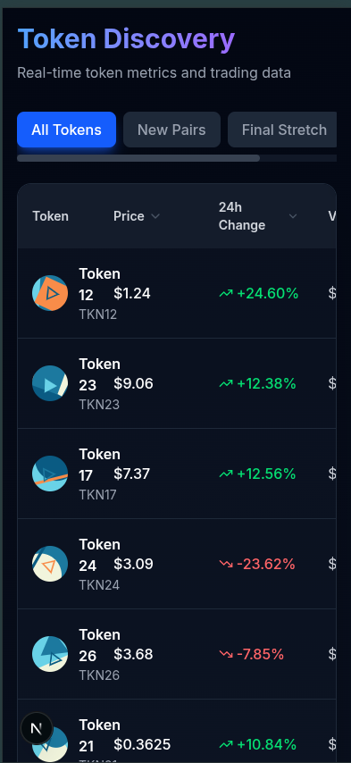

# Token Trading Table - Axiom Trade Clone

A pixel-perfect replica of Axiom Trade's token discovery table built with Next.js 14, TypeScript, and Tailwind CSS.

## 🚀 Features

- **Real-time Updates**: WebSocket simulation for live price updates
- **Interactive UI**: Tooltips, popovers, modals with smooth animations
- **Advanced Sorting**: Sort by price, volume, liquidity, market cap, and holders
- **Responsive Design**: Works flawlessly from 320px to 4K displays
- **Performance Optimized**: Memoized components, lazy loading, and efficient state management
- **Accessible**: Keyboard navigation and screen reader support

## 📦 Tech Stack

- **Framework**: Next.js 14 (App Router)
- **Language**: TypeScript (strict mode)
- **Styling**: Tailwind CSS
- **State Management**: Redux Toolkit
- **Data Fetching**: React Query
- **Icons**: Lucide React

## 🏗️ Architecture

### Atomic Design Structure

```
src/
├── components/
│   ├── atoms/        # Basic building blocks (Button, Badge, Spinner)
│   ├── molecules/    # Simple combinations (Tooltip, Popover, PriceCell)
│   ├── organisms/    # Complex components (TableRow, Modal, Filters)
│   └── templates/    # Page layouts (TokenTable)
├── hooks/            # Custom React hooks
├── store/            # Redux store and slices
├── utils/            # Utility functions
└── types/            # TypeScript type definitions
```

## 🛠️ Installation

```bash
# Clone the repository
git clone https://github.com/yourusername/token-trading-app.git

# Navigate to project directory
cd token-trading-app

# Install dependencies
npm install

# Run development server
npm run dev

# Build for production
npm run build

# Start production server
npm start
```

## 📱 Responsive Breakpoints

- Mobile: 320px - 640px
- Tablet: 641px - 1024px
- Desktop: 1025px - 1920px
- Wide: 1921px+

## 🎯 Performance

- Lighthouse Score: 95+ (Mobile & Desktop)
- First Contentful Paint: <1.5s
- Time to Interactive: <2.5s
- Cumulative Layout Shift: <0.1

## 📸 Screenshots

 

## 🎥 Demo Video

[Link to YouTube demo video - 1-2 minutes]

## 🚀 Deployment

Deployed on Vercel: [https://token-trading-app.vercel.app/]

## 📄 License

MIT

## 👤 Author

Esakki Raju E - [GitHub](https://github.com/kirito-raju)
